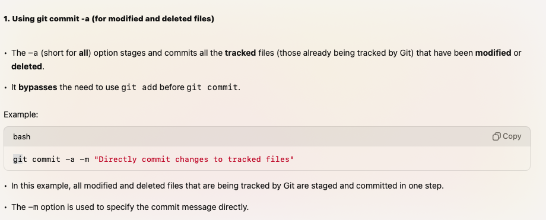

# Initializing the git Repo:

- Firstly we need to create a new directory [ which will work as a repository ] for our project using the mkdir command: `mkdir ${DirectoryName}`.
  - Navigate into the directory you created: `cd ${DirectoryName}`
- To turn the directory into a Git repository (so Git can start tracking changes), use the `git init` command.
  - This initializes an empty Git repository by creating a .git directory inside your project. The .git directory stores all the information Git needs to track changes to your project, like commit history and configuration.

# What is staging area or index?

- In Git, the staging area (also known as the index).
- The staging area is like a buffer or waiting room where you gather all the changes you want to commit. You add specific changes (file modifications, additions, or deletions) to the staging area, and only the files that are in this area will be included in the next commit
- Command used to move the file to staging area: `git add ${fileName}` or `git add .`
  - The files which are staged -> stored in the index, a file in the .git directory that holds information about what will be included in the next commit.

# Commiting stage:

- Git takes the staged files and saves them as a new commit in the repository’s history. The commit now contains a snapshot of the staged files at that moment.
- Command used to commit the changes -> `git commit -m '${commit_message}'`

- For every commit, Git generates a unique commit ID (also called a commit hash or SHA-1 hash). This commit ID is a 40-character hexadecimal string that uniquely identifies the commit in the repository’s history.

# commiting best practices

# Commiting the file withour staging:

- In Git, you can skip the staging area and commit changes directly from your working directory using the `git commit -a -m ${message}`.
- This command automatically stages all modified and deleted files (tracked files) and commits them, without needing to manually use git add for each file.

#### Note:

- The git commit -a command does not stage new, untracked files (files that were never added to Git). You still need to manually add untracked files with git add before committing them.
  
