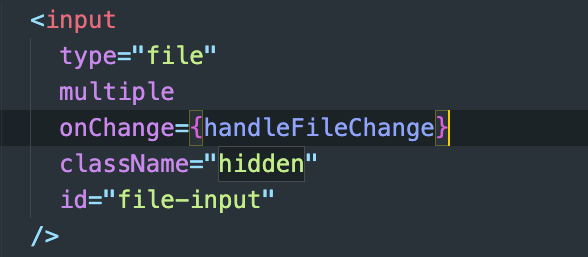

# Properties used:

- input tag:
- type: `File` -> This defines the type of input element as a file input, which means users can use it to upload files from their device (such as images, documents, etc.).
- `multiple` The multiple attribute allows the user to select more than one file at a time. Without this attribute, the user would only be able to select one file.

# Property used to disappear the input tag

- `style="display: none"`
- In tailwind we use `hidden` property
  - This hides the file input from the user. The input element won't be visible on the page. Usually, developers do this to trigger the file input using a button or some other UI element rather than displaying the standard file input.

# React code for input tag using Tailwind css:

