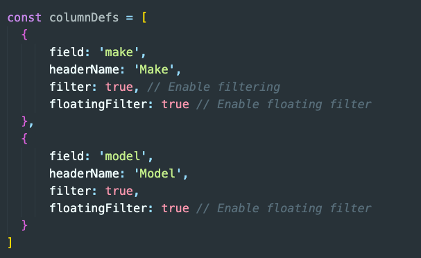

# Understanding the AG-grid Library

- Instal the dependency: `npm install ag-grid-react`
- Import the 3 command given in the document into the component where we want to create the table [ `see the AgGrid.jsx file`]
  

# Using `editable` key in the Column

- In AG Grid, you can make cells editable by using the editable property in the column definitions (columnDefs). This allows users to modify the data directly within the grid cells.

# Using `filter` key in the Column

- In AG Grid, you can makeIn AG Grid, filtering allows users to narrow down the displayed data based on specific criteria. You can enable filtering on columns by using the filter property in the column definitions (columnDefs cells editable by using the editable property in the column definitions (columnDefs). This allows users to modify the data directly within the grid cells.

## Commit 2: Default Column Definitions

- The example above demonstrates how to configure a single column. To apply this configuration across all columns we can use Default Column Definitions instead.

## Commit 3: CheckBoxSelection Property

- In AG Grid, the checkboxSelection property allows you to add checkboxes to your rows, enabling users to select one or more rows easily. This feature is particularly useful for scenarios where you need to allow multi-row actions, such as deletion, exporting, or processing selected row.
  - To enable checkboxes in your AG Grid rows, you can set the checkboxSelection property in your column definitions.

## Commit 4: floatingFilter

- Floating filters in AG Grid provide a user-friendly way to filter data in the grid. They appear directly above the grid and allow users to quickly filter the grid without having to open a separate filter menu. Floating filters can be especially useful for enhancing the overall user experience.
  - To enable floating filters in AG Grid, you need to set the floatingFilter property in your column definitions and also enable floating filters in your grid options.
    
