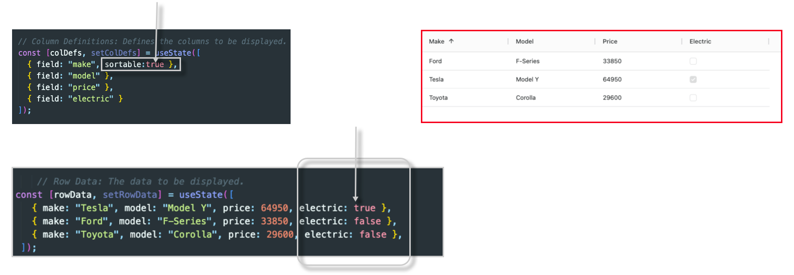

# Understanding the AG-grid Library

- Instal the dependency: `npm install ag-grid-react`
- Import the 3 command given in the document into the component where we want to create the table [ `see the AgGrid.jsx file`]
  

# Using `editable` key in the Column

- In AG Grid, you can make cells editable by using the editable property in the column definitions (columnDefs). This allows users to modify the data directly within the grid cells.

# Using `filter` key in the Column
- In AG Grid, you can makeIn AG Grid, filtering allows users to narrow down the displayed data based on specific criteria. You can enable filtering on columns by using the filter property in the column definitions (columnDefs cells editable by using the editable property in the column definitions (columnDefs). This allows users to modify the data directly within the grid cells.