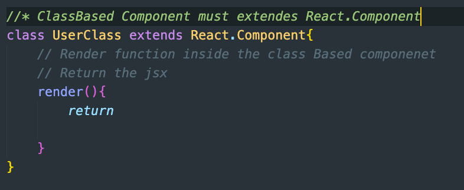

# Developing the Food Odering application with Namaste react

- Install the package.json file -> followed by parcel -> followed by react and react-dom `npm i react-dom`
- Defining the scripts in the package.json file
- add the .gitignore file.
- In the index.html file -> add `type = "module"` in the script tag
- In the `App.js` file -> import the react and react-dom. create the root component in which the App component is rendered

# Lecture 4 Step and time Stamping:

- At 19 min: we added the logo in the header component
- At 35 minutes: Create the Body structure with no css and no content only the heading
- At 59 minutes: Creating the Restaurant card with dynamic data: `Using Props`: passing the props to component and reading the props in the component

# To Do:

1. naming convention -> in named export -> the name of import shall be same as name of export whereas in default export -> can be different

---

# Lecture 5: let get hook

- Compartmentalise the application into the component -> rather than placing whole code inside the App.js
- the extension used for the component is either `jsx or js`. [ No difference ]
  - Technically, .jsx is used to indicate that the file contains JSX syntax, which allows writing HTML-like code inside JavaScript.
  - However, many projects just use .js even when JSX is used, and modern tooling (like Babel) is capable of handling both .js and .jsx files the same way.
  - So, in practice, there is no functional difference if your environment is set up correctly to handle JSX in .js files.
- Never place the `hardcoded data like (mockData, Url etc)` into the component file rather create a folder with name like
  - utils
  - constant/config etc and place the hardcoded data in this folder
  - The name shall start with small letters

### At 1hour 15 min -> we are creating a button on which when we click only the top rated restaurant is shown.

- By top rated restaurant, we means rating is greater than 4.
- Create the button and use the onClick method which calls the callback function [becoz we are passing the data parameter]
- create the state variable and onClick update the state variable -> on this state variable call the map function

### Last 25 minutes of lecture 5:

- The author discuss about `Reconciliation algorithm or React Fiber`
- `Diffing Algorithm`
- `Virtual DOM`

# Lecture 6: Exploring the World -> Understanding the API call

- Understand the `Separation of concern` and `Single Responsibility principle` in monolithic architecture. [ Done in starting of 10 minutes of lecture ]
- To make an Api Call -> we use following Approach & `useEffect` Hook:
  - As soon the page loads on browser -> we render the page and post render we make the API call.
- Deleted the mockData file from the utils folder as we are using the API to populate the state variable.

## useEffect Hook

- Imported as named_import
- It takes 2 parameters: a `callback function` and `dependencies array`
- the callback function in useEffect is called after the rendering of the page.
- Now we will use the useEffect hook to make the `API call`
- In the coding, we have created the state variable `filteredData` and assigned the empty array to it not the null value becoz map function is called on the array.

#### `Lecture 7: useEffect `

- generally useEffect function is called after the rendering of the page. But due to the dependencies array, we control the useEffect hook -> when to call.
- Cases:
  - case1: when there is no dependency array -> useEffect is called, `everytime` the rendering of the page
  - case2: when there is empty dependency array -> useEffect is called only `first time` when the page is rendered
  - case3: when there is dependency mentioned inside the array -> useEffect is called only when the the dependency changes.

## Spinner loader Logic:

- the state variable on which we have called the map function -> must be checked if it is empty or not.
- if the state variable is empty then we can apply spinner loader or
- if the state variable is not empty [ i.e. api call has been made ] then we can use the cards

## Shimmer UI

- A shimmer lets people know that a section of information is loading without blocking other UI elements from rendering.

## Search functionality:

- To provide the search functionality to the code -> we have created an input field and button.
- To track the input field we have used the state variable.
  - To get the value a user types into an input field, we need to add an `onChange handler`. This handler uses a callback function and receives an event (e). To get the user’s input, we access `e.target.value`
-

### See video: Time stamp Lecture 6:

- Using debugger for checking useEffect [ in inspect window ] => at 25 minutes post
- `Optional chaining` -> 48 min
- `Spinner loader` -> 50 min
- `Shimmer UI` -> 51 min
- Note: Whenever there is a change in a state variable, the component where the state is used re-renders, not the entire application. Only that component (or parts of it) where the state variable is used will be affected by the re-render -> `1:25 min`
  - In the coding when we click on the login button of header section, the value of state varible changes to logOut. the whole header section is rendered --> not the application or the button but whole component.
- `Search functionality` -> 1:36:44 minutes

# Lecture 7: Finding the Path @ Routing

- Install the react-router-dom [ Version 6 ] library.
- Develop the routing configuration in `App.js` file:

  - Import the create `createBrowserRouter` & use this createBrowserRouter function to provide the routing configuration. This function takes an `array of object` where you can specify which components should be displayed for different URLs (routes).
  - The object passed to createBrowserRouter has the following properties:
    - `path`: This defines the URL for the route.
    - `element/Component`: The React component that should be rendered when the user visits the specified URL.

- Now after creating the routes for the application, we need to provide the router configuration to the application for this we need to import `RouterProvider`

### errorElement:

- In createBrowserRouter, there is an additional property called `errorElement` that you can use to handle errors, such as when a user navigates to a route that doesn’t exist (404 errors) or any other routing errors.
- `errorElement`: This is used to specify the component that will be shown if an error occurs while loading a route, such as a wrong path or a problem with data fetching.

### Hook provided by react-router-dom: `useRouteError` [36 min]

- import the Hook
- const error = useRouteError(); // Get the error object
- this object has certain properties which we can use on the UI. I have consoled it -> Please check.

### Providing the children Routes [46 min]

- In React Router, nested routes (or children routes) allow you to create a parent route with multiple child routes. This setup is useful when you want a layout (like a sidebar or navbar) to stay the same, while the content inside the layout changes based on the child route.
- `Outlet`: This is where the child route’s component will be rendered. Whenever you navigate to a child route, React Router will replace the Outlet with the appropriate child component (e.g., Home, About, or Contact).

### Link tag vs NavLink vs anchor tag

### Types of routing [ 1: 05 min]

- there are 2 type of routing in the web application:
  - client-side routing
  - server-side routing

### Dynamic routing in react [ 1 hour 12 min ]

### useParam hook [ 2hour ]

- The useParams hook is part of the React Router library, and it is used to access the parameters of the current route. When building applications with dynamic routes, useParams helps retrieve route parameters, which can then be used to fetch data, display specific content, or perform other operations based on the route.

# Lecture 8: Class Based Component

- In the about Us page, we are creating a class Component which shows the details of the user.

  - A class Based component extends React.Component
  - The class Based component has the render function which return the jsx
  - 
  - Just like the functional component, we need to export the classBased component

- Passing & consuming the `Props` into the class Based component [ 16 minutes ]
  - props are passed -> Similar to the functional component [ see About.js file ]
  - Props are consumed using the constructor -> see UserClass.js file.
    - Inside the constructor of the class based component it is mandatory to use super(props) keyword
    - to access the prop -> we need to use the following keyword `this.props`
