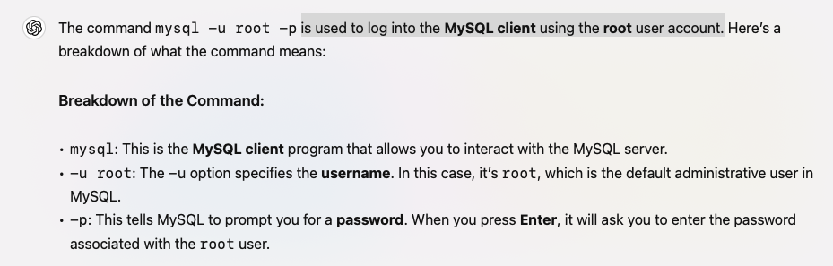
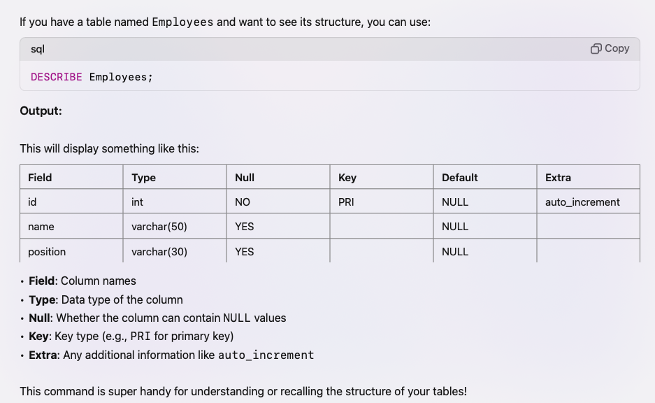

# Lecture 2:

- Promopt to open the Mysql client in the terminal:
  - `mysql -u ${username} -p`: is used to log into the MySQL client using the root user account.
    - mysql -u root -p
  - password: 123456789 in my case



### Creating the schema in MySQL:

- `CREATE DATABSE ${Name_of_dataBase}`

### To use the database/schema we need the following command:

- `use ${Name_of_dataBase}`

### Other command:

- `SELECT USER()`: This command retrieves the username and hostname of the current MySQL user that is connected to the server. It returns a string in the format 'username@hostname'.
- `SELECT DATABASE()`: This command retrieves the name of the currently selected database (schema) in the session. It returns the name of the database if one is selected; otherwise, it returns NULL.

### Comments in the sql:

- In SQL, comments are used to add explanatory notes or annotations to your code. There are 2 type of comments:

  A. `Single line comments`: Single-line comments are used for brief notes. You can use two dashes (--) followed by your comment.
  B. `Multi-Line Comments`: Multi-line comments can span multiple lines and are enclosed within `/* Comment */`

### Extra: 1 hours 28 minutes

- the teacher has created a table with the columns as `rollNumber, name & marks` -> with datatype of individual columns as `int, varchar, double`.
- To populate the data into the table -> the teacher has used `Insert into` command

-- EXTRA:

- In future if we want to see the structure of the table created by use we can use the `DESCRIBE` Commnad.
  - Syntax:`DESCRIBE ${tableName}`
  - You can use the DESCRIBE command to view the structure of a table in SQL. It shows important details like the column names, data types, and any constraints (e.g., if a column is a primary key, allows NULL, etc.



# Lecture 3: [ 1hour 7 min]: char vs varchar vs Text

### Syntax for table creation in schema/dataBase

```SQL
  CREATE TABLE table_name (
    column1 datatype constraints,
    column2 datatype constraints,
    ...
  );
```

### Syntax for Feeding the data:

```SQL
INSERT INTO table_name (column1, column2, column3, ...)
VALUES (value1, value2, value3, ...);
```
